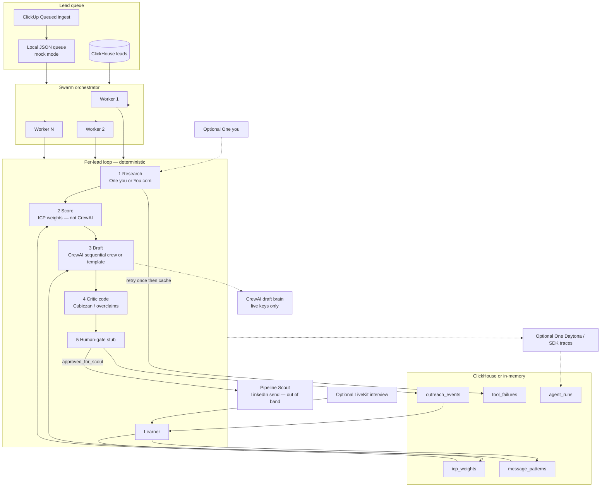
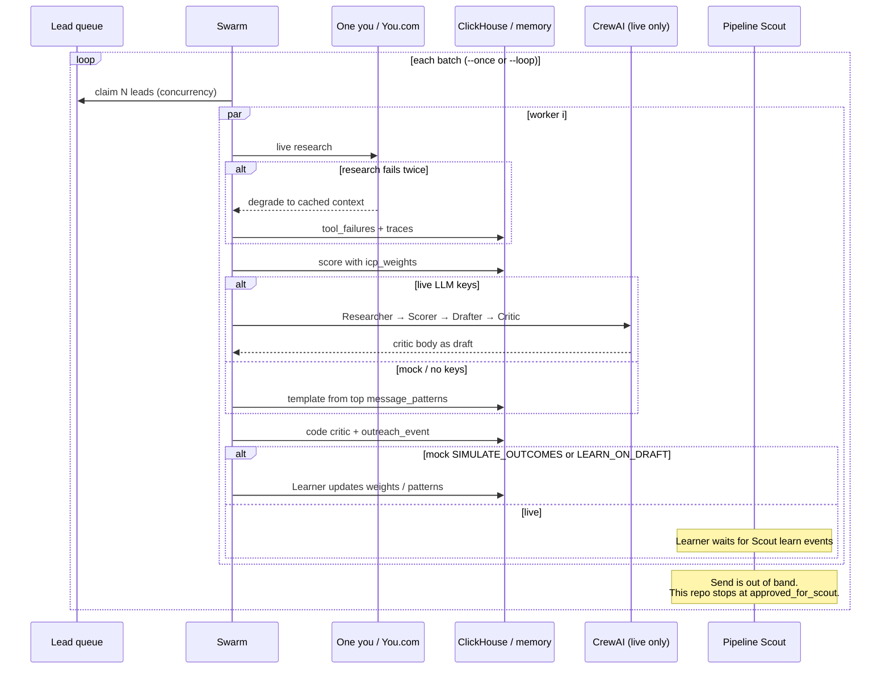

# Self Improving Outreach

A closed-loop system for **any outbound sales / outreach** — not a finance-only or CFO/CIO product. Research a lead, score it against *your* ICP weights, draft a message, then **learn** from what happened so the next draft is better.

The repo ships **example** ICP features and message angles from one Cubiczan-style finance demo. Swap the weights and patterns for any market.

**CrewAI is the live draft brain inside each swarm worker — not the whole system.** Scoring, pattern selection, brand critique, failover, and learning are deterministic Python. CrewAI only writes prose when live LLM keys are on.

This repo **does not send** LinkedIn or email. Drafts stop at `approved_for_scout`. Pipeline Scout / Marketing Hunter own send.

```text
lead queue  →  swarm worker  →  research → score → draft → critic → gate
                                      │
                                      └─ outreach_event → Learner → icp_weights
                                                                   message_patterns
```

---

## What runs per lead

Every lead — mock or live — goes through the same closed loop:

1. **Research** — You.com Search / Research, with failover to cached ClickHouse context. Prefers One `you` when `ONE_SECRET` (or One CLI auth) and `ONE_YOU_CONNECTION_KEY` are set (`RESEARCH_PROVIDER=auto|one`). Otherwise HTTP with `YOU_API_KEY` / `YDC_API_KEY`. Retry once, then degrade and log `tool_failures`.
2. **Score** — Deterministic ICP math from ClickHouse `icp_weights` (**not** CrewAI). Whatever features you store are multiplied by those weights. The demo set includes examples such as `material_weakness_or_sox`, `cfo_cio_title`, and `finance_ops_pain`.
3. **Draft** — If live LLM keys are on (`MOCK_MODE=false` plus OpenAI or Boundless), CrewAI runs a **sequential** crew: Researcher → Scorer → Drafter → Critic. The critic’s body becomes the outreach draft. If CrewAI is off or the LLM call fails, Drafter fills the highest-scoring `message_patterns` template.
4. **Critic (code)** — Second pass for **Cubiczan** brand spelling (never CubicZan) and overclaims (`guarantee`, length). Revises the body in place.
5. **Gate + log + learn** — Human-gate stub, `outreach_event` in ClickHouse (or the in-memory store). Live production waits for Scout `learn` events unless `LEARN_ON_DRAFT=true`. Mock + `SIMULATE_OUTCOMES=true` still updates the Learner after each draft so a demo batch visibly shifts weights.

When CrewAI is off (mock / no OpenAI or Boundless): the **same pipeline still runs** with template drafts from winning patterns. That is how CI and dry runs work.

---

## Self-improving loop

The Learner is the point of the system. Later batches read the weights and pattern scores this batch just wrote.

### What learns (in ClickHouse)

| Store | What changes |
| --- | --- |
| **`icp_weights`** | Any feature keys you persist. After each outcome, Learner nudges the matching features by **± learning rate 0.12**, clamped **0.15–2.5**. Meetings reward more than a reply; thumbs-down penalizes more than ignore. **Examples** in this repo: `material_weakness_or_sox`, `cfo_cio_title`, `finance_ops_pain` (also `multi_entity_or_treasury`, `enterprise_or_midmarket`, `agentic_readiness`, `industry_fit`). |
| **`message_patterns`** | Any outreach angles you persist. Wins / losses / impressions update a Bayesian score `(wins + 1) / (impressions + 2)`. Drafter always picks the **highest-scoring** pattern for the channel. **Examples** in this repo: `mw-90d`, `close-governed`, `treasury-obs` (`recon-auto`, `cfo-cio-copilot` too). |

If ClickHouse is unset, an in-memory store keeps the same semantics so mock mode still learns.

### Feedback that drives it

`thumbs_up` / `thumbs_down` / `replied` / `meeting` / `ignore` / `sent` — from:

- explicit `learn` events (the live path)
- Pipeline Scout outcomes (after a real send, out of band)
- optional LiveKit preference interviews (`metadata.source=livekit`)

`SIMULATE_OUTCOMES=true` in mock mode invents an outcome from the score + angle so a demo swarm **visibly shifts weights** across batches. In the shipped example data, material-weakness and treasury angles win more often in that simulator. On the live path, `drafted` does **not** invent CRM replies unless `LEARN_ON_DRAFT=true`, `MOCK_LEARN_OUTCOMES=true`, or `swarm --learn-simulated`. Production should wait for real Scout / ClickUp / LiveKit outcomes.

```bash
uv run python -m self_improving_outreach learn --event \
  '{"lead_id":"11111111-1111-1111-1111-111111111111","outcome":"meeting","pattern_id":"mw-90d"}'
uv run python -m self_improving_outreach learn --event \
  '{"lead_id":"11111111-1111-1111-1111-111111111111","outcome":"thumbs_up","pattern_id":"mw-90d"}'
```

### What does not auto-send

```text
research → score → draft → critic → human-gate → approved_for_scout
```

Send stays with Pipeline Scout (out of band). `HUMAN_GATE_ENABLED=true` writes `pending_approvals.jsonl` and holds the lead at `pending_review` instead of `approved_for_scout`.

---

## Architecture

Each swarm worker runs the closed loop above. CrewAI sits **inside** the draft step when live. One `you` / One Daytona are optional; direct You.com and Daytona SDK are the fallbacks.



### Swarm batch



A tool failure in **one** worker switches that worker to the failover path. Other workers keep running. Daytona (or the local tracer) records spans onto `agent_runs`.

Behavior specs: [`openspec/specs/`](openspec/specs/) (outreach pipeline, learning loop, swarm, ClickHouse, LLM provider).

---

## Quick start (mock, no API keys)

```bash
cp .env.example .env          # MOCK_MODE=true is the default
uv sync --group dev
uv run pytest
uv run python -m self_improving_outreach show-config
# Example lead from the shipped demo ICP (any company / title / pain works)
uv run python -m self_improving_outreach run --lead '{"company":"Northline Manufacturing","title":"CFO","contact_name":"Priya Shah","industry":"manufacturing","signals":{"pain":"material weakness"}}'
uv run python -m self_improving_outreach swarm --once --concurrency 3
```

CI (`.github/workflows/ci.yml`) runs the same mock pytest path. No secrets required.

Continuous swarm (claim, sleep, repeat):

```bash
uv run python -m self_improving_outreach swarm --concurrency 5 --loop --interval 300
```

Reclaim leads so the swarm can claim them again (`queued`). The committed `data/leads.sample.json` file is never overwritten.

```bash
uv run python -m self_improving_outreach requeue --lead-id 11111111-1111-1111-1111-111111111111
uv run python -m self_improving_outreach requeue --company "Northline"
uv run python -m self_improving_outreach requeue --all-sample
uv run python -m self_improving_outreach requeue --clear-processing
uv run python -m self_improving_outreach requeue --status processing
uv run python -m self_improving_outreach requeue --status failed
uv run python -m self_improving_outreach requeue --status done          # drafted / approved / learned
uv run python -m self_improving_outreach swarm --once --requeue        # reclaim processing+failed, then claim
uv run python -m self_improving_outreach swarm --once --learn-simulated
```

Ingest a ClickUp **Queued** task (or webhook envelope with a `task` object) into the same queue. Search + outreach only.

```bash
uv run python -m self_improving_outreach ingest-clickup --file data/clickup_task.sample.json
uv run python -m self_improving_outreach queue upsert --from-json '{"company":"Acme","contact_name":"Jane","title":"CFO"}'
```

Non-Queued ClickUp tasks are skipped unless you pass `--force`.

Poll the Sales Leads list (default `CLICKUP_LIST_ID=901716996906`) when you have a token. Re-poll is idempotent and does not reset an in-flight lead:

```bash
uv run python -m self_improving_outreach clickup-sync
uv run python -m self_improving_outreach clickup-sync --dry-run
```

Optional GitHub Action stub: `.github/workflows/clickup-sync.yml` (`workflow_dispatch` only).

### Live env (names only — never commit values)

Copy `.env.example` → `.env` (gitignored). Fill only the providers you have. Missing keys keep that integration in mock / no-op.

| Variable | Used for |
| --- | --- |
| `RESEARCH_PROVIDER` | `auto` (default), `one`, or `you` |
| `SANDBOX_PROVIDER` | `auto` (default), `one`, or `daytona` |
| `ONE_SECRET`, `ONE_CLI`, `ONE_CLI_AUTH` | One CLI auth (`one --agent`); CLI login also works |
| `ONE_YOU_CONNECTION_KEY`, `ONE_DAYTONA_CONNECTION_KEY` | One connection keys (env only) |
| `ONE_DAYTONA_DOCKERFILE`, `ONE_DAYTONA_SNAPSHOT` | One sandbox create defaults (`buildInfo.dockerfileContent` + optional snapshot) |
| `YOU_API_KEY` or `YDC_API_KEY` | Direct You.com Search / Contents / Research fallback |
| `LLM_PROVIDER` | `openai` (default) or `boundless` |
| `OPENAI_API_KEY`, `CREWAI_MODEL` | Live CrewAI prose via OpenAI |
| `BOUNDLESS_API_KEY`, `BOUNDLESS_BASE_URL`, `BOUNDLESS_MODEL` | OpenAI-compatible Boundless inference |
| `CLICKHOUSE_HOST`, `CLICKHOUSE_USER`, `CLICKHOUSE_PASSWORD`, `CLICKHOUSE_DATABASE`, `CLICKHOUSE_PORT`, `CLICKHOUSE_SECURE` | ClickHouse Cloud or local |
| `DAYTONA_API_KEY`, `DAYTONA_API_URL`, `DAYTONA_OTEL_ENABLED` | Daytona SDK + OTEL traces (fallback when One Daytona is unset) |
| `LIVEKIT_API_KEY`, `LIVEKIT_API_SECRET`, `LIVEKIT_URL` | Optional live voice room (not required for transcript ingest) |
| `LIVEKIT_FEEDBACK_AUTO`, `LIVEKIT_TRANSCRIPT_PATH` | Optional post-draft transcript→Learner hook (or interview stub when LiveKit is configured) |
| `CLICKUP_API_TOKEN`, `CLICKUP_LIST_ID`, `CLICKUP_QUEUE_STATUS` | Optional ClickUp list poll (`clickup-sync`) |
| `MOCK_MODE`, `HUMAN_GATE_ENABLED`, `SIMULATE_OUTCOMES` | Runtime behavior |
| `LEARN_ON_DRAFT`, `MOCK_LEARN_OUTCOMES` | Opt-in draft-time Learner on the live path (default `false`) |

### `show-config`

```bash
uv run python -m self_improving_outreach show-config
```

Prints **booleans, provider names, and effective paths only** — never secret values. Use it to confirm `mock_mode`, `crewai`, `llm_provider`, `research_provider` (`one` / `you` / `mock`), `sandbox_provider` (`one` / `daytona` / `none`), `one_you_configured`, `learn_on_draft`, and `should_learn_on_draft`.

---

## Optional pieces

### ClickHouse

Schema: `migrations/clickhouse/001_init.sql` (`leads`, `outreach_events`, `message_patterns`, `icp_weights`, `tool_failures`, `agent_runs`).

```bash
docker compose up -d
# CLICKHOUSE_HOST=localhost CLICKHOUSE_PORT=8123 CLICKHOUSE_SECURE=false
# CLICKHOUSE_USER=default CLICKHOUSE_PASSWORD=localdev CLICKHOUSE_DATABASE=outreach
uv sync --extra clickhouse
uv run python -m self_improving_outreach migrate
```

Cloud: host from the ClickHouse Cloud console (HTTPS 8443, `CLICKHOUSE_SECURE=true`).

### One `you` / One Daytona

When One auth and connection keys are set, research prefers One `you` over raw `YDC_API_KEY`, and sandbox create/delete prefer One Daytona over the SDK.

```bash
# .env — connection keys from `one list` (never commit live keys)
RESEARCH_PROVIDER=auto
SANDBOX_PROVIDER=auto
ONE_SECRET=
ONE_YOU_CONNECTION_KEY=
ONE_DAYTONA_CONNECTION_KEY=
```

The adapter runs the One CLI (JSON agent mode), not a hardcoded HTTP client:

```bash
one --agent actions search you "search" -t execute
one --agent actions execute you <actionId> "$ONE_YOU_CONNECTION_KEY" -d '{"query":"...","count":5}'
```

One create-sandbox requires `buildInfo.dockerfileContent`. Name-only tracer creates merge a default Dockerfile (`FROM daytonaio/sandbox:latest`) and an optional snapshot (`ubuntu-4vcpu-8ram-100gb`). Override with `ONE_DAYTONA_DOCKERFILE` / `ONE_DAYTONA_SNAPSHOT` (blank snapshot omits the field).

Without One auth + keys, the existing direct You.com / Daytona clients run unchanged. `MOCK_MODE=true` still uses the mock researcher.

### CrewAI live (OpenAI or Boundless)

`use_crewai` is true only when `MOCK_MODE` is not forcing mock **and** an LLM key is present. Boundless is OpenAI-compatible:

| | |
| --- | --- |
| Base URL | `https://api.inference.boundless.network/v1` |
| Auth | `Authorization: Bearer $BOUNDLESS_API_KEY` |
| Default model | `glm-5.2` (`dsv4`, `qwen3.6`, `nemotron3-super`, `kimi-k3` also work) |

Do **not** use `api.boundlessapi.com`. `LLM_PROVIDER=boundless` points CrewAI / LiteLLM at that `base_url`. If `LLM_PROVIDER=openai` but only `BOUNDLESS_API_KEY` is set, Boundless is the fallback. Each live crew runs several LLM tasks and **does spend** inference credit.

```bash
# .env — never commit this file
MOCK_MODE=false
LLM_PROVIDER=boundless
BOUNDLESS_API_KEY=          # paste locally only
BOUNDLESS_BASE_URL=https://api.inference.boundless.network/v1
BOUNDLESS_MODEL=glm-5.2

uv sync --extra crew
uv run python -m self_improving_outreach show-config
uv run python -m self_improving_outreach swarm --once --concurrency 2
```

### Daytona SDK fallback

When One Daytona is not selected and `DAYTONA_API_KEY` plus the `daytona` extra are present, the tracer uses the Daytona SDK. `DAYTONA_SANDBOX_RUNS=true` optionally creates a sandbox per session — not required for drafts. Without the SDK/key, spans still land on `agent_runs.traces`.

### LiveKit → Learner

Optional preference interview (live room or saved JSON). Same Learner path as `learn`. Core text pipeline does not require LiveKit. `LIVEKIT_FEEDBACK_AUTO` defaults to **false**.

```bash
uv run python -m self_improving_outreach voice --lead-id 11111111-1111-1111-1111-111111111111 --positive
uv run python -m self_improving_outreach voice --lead-id 11111111-1111-1111-1111-111111111111 --transcript-file data/voice_transcript.sample.json
```

After a draft, `LIVEKIT_FEEDBACK_AUTO=true` plus `LIVEKIT_TRANSCRIPT_PATH` (file or `{lead_id}.json` directory) calls `record_voice_feedback` and writes `outreach_event` with `metadata.source=livekit`. If LiveKit is configured and no transcript file exists, the preference-interview stub applies a sample transcript (`metadata.stub=true`). Without LiveKit keys and without a file, auto is a no-op.

---

## Layout

```
src/self_improving_outreach/   # CLI, crews, swarm, stores, tools, voice, llm provider
migrations/clickhouse/         # DDL
data/leads.sample.json         # 3 example leads (demo ICP)
data/voice_transcript.sample.json
data/clickup_task.sample.json  # ClickUp webhook → queued lead
openspec/specs/                # living behavior specs
```

Extras: `uv sync --extra crew` · `--extra clickhouse` · `--extra daytona` · `--extra livekit` · `--extra you`.
