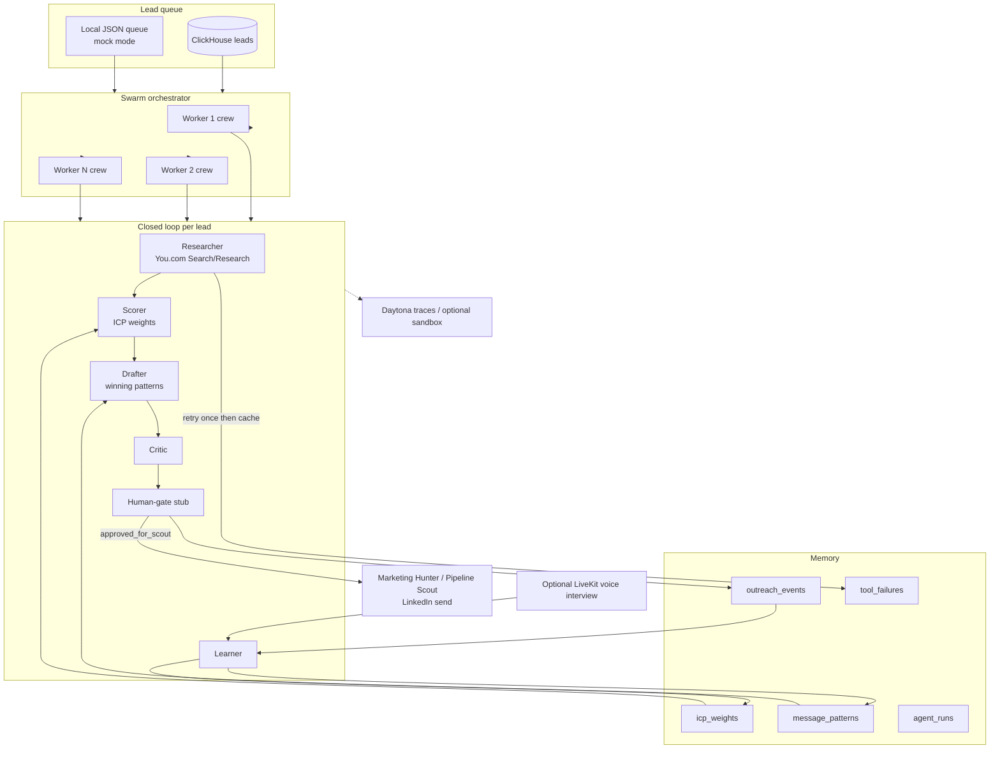
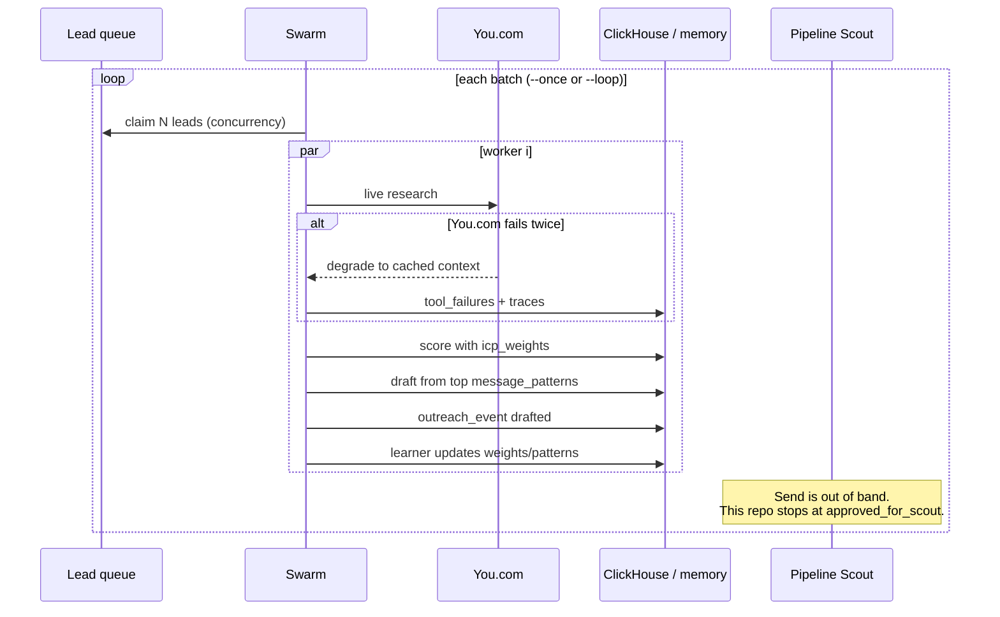

# Cubiczan self-improving outreach

Production scaffold for Cubiczan sales outreach and pipeline agents. Crews **draft and learn**. They do **not** send LinkedIn or email — **Marketing Hunter / Pipeline Scout** own send.

Brand is **Cubiczan** (never CubicZan). Founder: Sam / Shyam Desigan. Positioning: agentic CFO/CIO, governed multi-agent finance (close, reconciliation, treasury, observability), 90-day material-weakness remediation.

## Architecture



### Swarm loop



A tool failure in **one** worker switches that worker to the failover path. Other workers keep running. Daytona (or the local tracer) records spans onto `agent_runs`.

## Closed loop

1. **Researcher** — You.com Search (`POST https://ydc-index.io/v1/search`) and Research (`POST https://api.you.com/v1/research`). Auth header `X-API-Key` (`YOU_API_KEY` or `YDC_API_KEY`). Retry once, then cached lead context.
2. **Scorer** — Weighted ICP features stored in `icp_weights` (CFO/CIO title, SOX / material weakness, recon/treasury, industry fit, …).
3. **Drafter** — Picks the highest-scoring Cubiczan angle from `message_patterns`.
4. **Critic** — Brand spelling, overclaims, length. Does not send.
5. **Human-gate stub** — `HUMAN_GATE_ENABLED=true` writes `pending_approvals.jsonl`; otherwise `approved_for_scout`.
6. **Learner** — Explicit outcomes (`thumbs_up` / `thumbs_down` / `replied` / `meeting` / `ignore` / `sent`) update weights and pattern win rates. Mock swarm can simulate outcomes so the next batch prefers winning angles.
7. **Voice (optional)** — LiveKit Agents preference interview writes the same Learner path. Core text crew does not require LiveKit.

CrewAI is used when `crewai` is installed and an LLM key is present (`OPENAI_API_KEY`, or Boundless via `LLM_PROVIDER=boundless` / Boundless fallback). Otherwise a deterministic mock crew runs the same stages (CI and laptop demos).

## Quick start (mock, no API keys)

```bash
cp .env.example .env          # MOCK_MODE=true is the default
uv sync --group dev
uv run pytest
uv run python -m self_improving_outreach show-config
uv run python -m self_improving_outreach run --lead '{"company":"Northline Manufacturing","title":"CFO","contact_name":"Priya Shah","industry":"manufacturing","signals":{"pain":"material weakness"}}'
uv run python -m self_improving_outreach swarm --once --concurrency 3
```

Continuous swarm (claims the queue, sleeps, repeats):

```bash
uv run python -m self_improving_outreach swarm --concurrency 5 --loop --interval 300
```

Learn from a real outcome after Pipeline Scout reports back:

```bash
uv run python -m self_improving_outreach learn --event '{"lead_id":"11111111-1111-1111-1111-111111111111","outcome":"meeting","pattern_id":"mw-90d"}'
```

## API keys locally

1. Copy `.env.example` → `.env` (gitignored).
2. Fill only the providers you have. Missing keys keep that integration in mock / no-op.

| Variable | Used for |
| --- | --- |
| `YOU_API_KEY` or `YDC_API_KEY` | You.com Search / Contents / Research |
| `LLM_PROVIDER` | `openai` (default) or `boundless` |
| `OPENAI_API_KEY`, `CREWAI_MODEL` | Live CrewAI prose via OpenAI |
| `BOUNDLESS_API_KEY`, `BOUNDLESS_BASE_URL`, `BOUNDLESS_MODEL` | OpenAI-compatible Boundless inference |
| `CLICKHOUSE_HOST`, `CLICKHOUSE_USER`, `CLICKHOUSE_PASSWORD`, `CLICKHOUSE_DATABASE`, `CLICKHOUSE_PORT`, `CLICKHOUSE_SECURE` | ClickHouse Cloud or local |
| `DAYTONA_API_KEY`, `DAYTONA_API_URL`, `DAYTONA_OTEL_ENABLED` | Daytona client + OTEL traces |
| `LIVEKIT_API_KEY`, `LIVEKIT_API_SECRET`, `LIVEKIT_URL` | Optional live voice room (not required for transcript ingest) |
| `LIVEKIT_FEEDBACK_AUTO`, `LIVEKIT_TRANSCRIPT_PATH` | Post-draft Learner hook from a JSON transcript |
| `MOCK_MODE`, `HUMAN_GATE_ENABLED`, `SIMULATE_OUTCOMES` | Runtime behavior |

Never commit `.env`. The CLI `show-config` prints booleans only — not secret values.

## GitHub Actions secrets

Repository **Settings → Secrets and variables → Actions**. Use the same names as `.env.example`. CI (`/.github/workflows/ci.yml`) runs `uv run pytest` with `MOCK_MODE=true` and does **not** need secrets. Add keys only if you introduce a non-mock integration job:

`YOU_API_KEY`, `YDC_API_KEY`, `DAYTONA_API_KEY`, `DAYTONA_API_URL`, `LIVEKIT_API_KEY`, `LIVEKIT_API_SECRET`, `LIVEKIT_URL`, `CLICKHOUSE_HOST`, `CLICKHOUSE_USER`, `CLICKHOUSE_PASSWORD`, `CLICKHOUSE_DATABASE`, `OPENAI_API_KEY`, `BOUNDLESS_API_KEY`, `BOUNDLESS_BASE_URL`, `BOUNDLESS_MODEL`, `LLM_PROVIDER`.

## Vercel project env

This repo is a Python worker, not a Next.js app. If you later attach a Vercel cron or webhook:

```bash
# names only — paste values in the Vercel UI or CLI prompts
vercel env add YOU_API_KEY
vercel env add OPENAI_API_KEY
# …repeat for the table above
vercel env pull .env.local
```

Do not put secrets in `vercel.ts` / `vercel.json`.

## ClickHouse

Schema: `migrations/clickhouse/001_init.sql` (`leads`, `outreach_events`, `message_patterns`, `icp_weights`, `tool_failures`, `agent_runs`).

Local:

```bash
docker compose up -d
# .env
# CLICKHOUSE_HOST=localhost
# CLICKHOUSE_PORT=8123
# CLICKHOUSE_SECURE=false
# CLICKHOUSE_USER=default
# CLICKHOUSE_PASSWORD=localdev
# CLICKHOUSE_DATABASE=outreach
uv sync --extra clickhouse
uv run python -m self_improving_outreach migrate
```

Cloud: host from the ClickHouse Cloud console (HTTPS 8443, `CLICKHOUSE_SECURE=true`). If ClickHouse is unset, an in-memory store keeps the same learning semantics.

## Daytona

The `RunTracer` interface wraps every crew/swarm span. When `DAYTONA_API_KEY` is set and the `daytona` extra is installed:

```python
from daytona import Daytona, DaytonaConfig
config = DaytonaConfig(
    api_key=os.environ["DAYTONA_API_KEY"],
    api_url=os.environ.get("DAYTONA_API_URL", "https://app.daytona.io/api"),
    otel_enabled=True,  # or DAYTONA_OTEL_ENABLED=true
)
daytona = Daytona(config)
```

`DAYTONA_SANDBOX_RUNS=true` optionally creates a sandbox per session. MVP tracing does not require that. Without the SDK/key, spans still land on `agent_runs.traces`.

## Boundless (burn credits on `swarm --once`)

Sam's credit is on **boundless.network**. This repo defaults `BOUNDLESS_BASE_URL` to BoundlessAPI (`https://api.boundlessapi.com/v1`). If the dashboard that issued the key shows a different OpenAI-compatible URL, override it.

| Credit source | `BOUNDLESS_BASE_URL` | Typical `BOUNDLESS_MODEL` |
| --- | --- | --- |
| BoundlessAPI catalog (default) | `https://api.boundlessapi.com/v1` | `gpt-4o-mini` (or a live catalog id such as `gpt-5.4-mini`) |
| boundless.network inference | `https://api.inference.boundless.network/v1` | `glm-5.2` |

```bash
# .env — never commit this file
MOCK_MODE=false
LLM_PROVIDER=boundless
BOUNDLESS_API_KEY=          # paste locally only
BOUNDLESS_BASE_URL=https://api.boundlessapi.com/v1
# If Sam's dashboard is boundless.network inference instead:
# BOUNDLESS_BASE_URL=https://api.inference.boundless.network/v1
# BOUNDLESS_MODEL=glm-5.2
BOUNDLESS_MODEL=gpt-4o-mini
# YOU_API_KEY=              # optional; without it, research stays mocked
```

```bash
uv sync --extra crew
uv run python -m self_improving_outreach show-config   # booleans only; no secrets
uv run python -m self_improving_outreach swarm --once --concurrency 2
```

`LLM_PROVIDER=boundless` points CrewAI / LiteLLM at Boundless (`base_url` + key, also copied to `OPENAI_API_KEY` / `OPENAI_BASE_URL`). If `LLM_PROVIDER=openai` but only `BOUNDLESS_API_KEY` is set, Boundless is the fallback. Each live crew runs several LLM tasks — this **does** spend Boundless credit. Keep `MOCK_MODE=true` (the default) for CI and laptop demos.

## LiveKit learner loop

Marketing Hunter or an AE runs a **preference interview** (LiveKit room, or a saved JSON transcript). That interview feeds the **Learner** (`thumbs_up` / `thumbs_down`, notes, optional `pattern_id`). **Pipeline Scout / Marketing Hunter still own LinkedIn send** — this repo never posts.

```bash
# Mock thumbs (no LiveKit keys required)
uv run python -m self_improving_outreach voice --lead-id 11111111-1111-1111-1111-111111111111 --positive
uv run python -m self_improving_outreach voice --lead-id 11111111-1111-1111-1111-111111111111 --no-positive

# Parse a saved interview transcript
uv run python -m self_improving_outreach voice \
  --lead-id 11111111-1111-1111-1111-111111111111 \
  --transcript-file data/voice_transcript.sample.json
```

Transcript JSON (any of `positive`, `sentiment`, `outcome`, `thumbs` for polarity):

```json
{
  "lead_id": "11111111-1111-1111-1111-111111111111",
  "positive": true,
  "pattern_id": "mw-90d",
  "notes": "CFO preferred the 90-day material-weakness angle",
  "transcript": "optional interview text"
}
```

After a successful pipeline draft, set `LIVEKIT_FEEDBACK_AUTO=true` and `LIVEKIT_TRANSCRIPT_PATH` to a file or a directory of `{lead_id}.json` files. The hook calls `record_voice_feedback` and writes an `outreach_event` with `metadata.source=livekit`.

```bash
uv sync --extra livekit
uv run python -m self_improving_outreach voice --lead-id <uuid>
```

Without LiveKit keys the command stays idle for rooms and still records mock / file feedback. A live `AgentSession` should call `record_voice_feedback` after the interview.

## How outcomes feed learning

| Signal | Effect |
| --- | --- |
| `meeting`, `replied`, `thumbs_up` | Raise ICP weights for features present on the lead; raise pattern win rate |
| `ignore`, `thumbs_down` | Lower those weights and the pattern score |
| `sent` | Small positive (Pipeline Scout actually sent) |
| You.com exception | `tool_failures` row; second failure degrades to cache; swarm continues |
| Voice thumbs / transcript | Same as explicit thumbs via Learner; `outreach_events.metadata.source=livekit` |

Drafter always reads **current** `message_patterns` ordered by score, so the next swarm batch prefers angles that worked.

## Layout

```
src/self_improving_outreach/   # CLI, crews, swarm, stores, tools, voice, llm provider
migrations/clickhouse/         # DDL
data/leads.sample.json         # 3 mock ICP leads
data/voice_transcript.sample.json
openspec/specs/                # living behavior specs
```

Optional extras: `uv sync --extra crew` · `--extra clickhouse` · `--extra daytona` · `--extra livekit` · `--extra you`.
