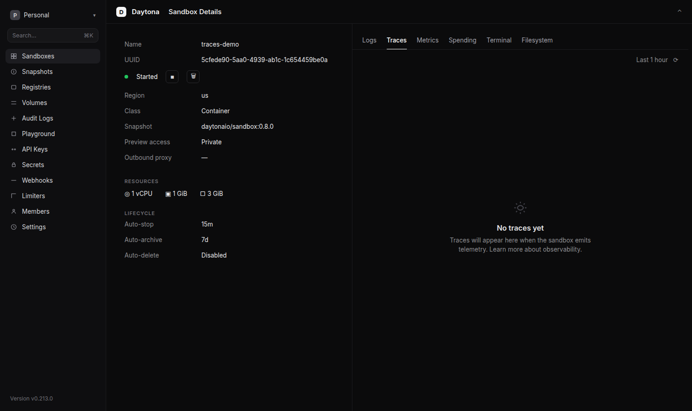

# Daytona — Cubiczan Self Improving Outreach

Dashboard screenshot of Daytona **Sandbox Details → Traces** for sandbox `traces-demo`.

The Traces tab can stay empty until the sandbox emits telemetry. That empty state is expected; Cubiczan Self Improving Outreach still records local spans on `agent_runs` when the dashboard has nothing to show.

This folder is documentation only. It does not invent outreach or sandbox metrics.

See also the 2026-09-11 US live sandbox retest record (`live-retest-2026-09-11.md`). That run is a different sandbox than `traces-demo`.
